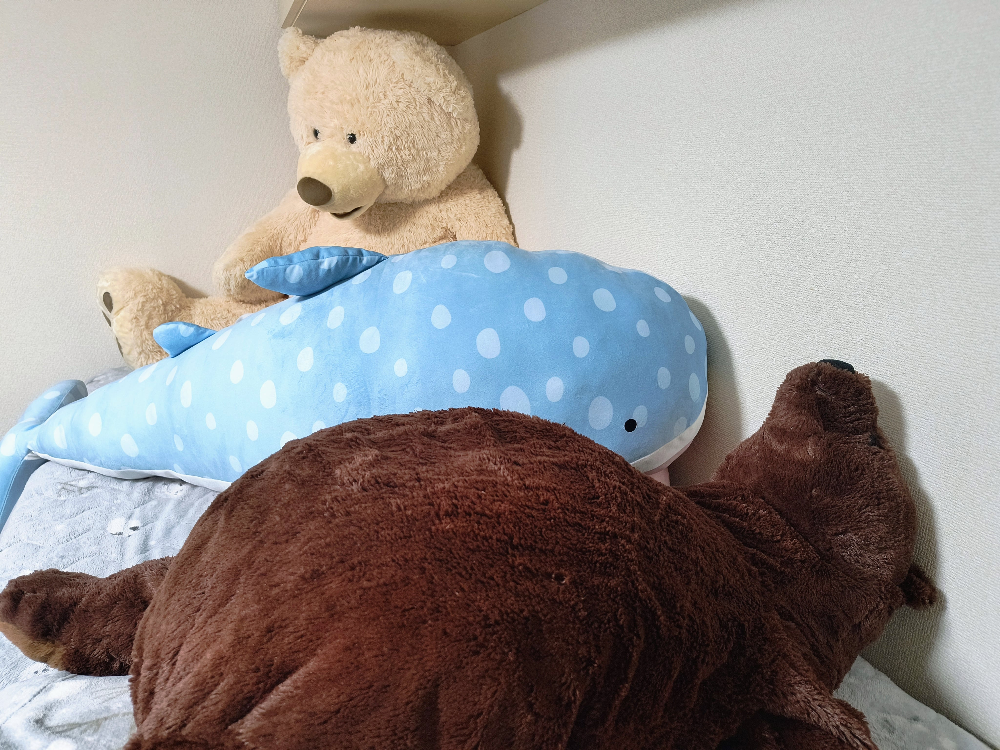

# 自己紹介
<!--
_class: lead
_paginate: false
_header: ""
-->

## はじめに
- 名前
  - 笹川 尋翔
- 出身
  - 新潟県上越市
- 専攻
  - ソフトウェア開発
    プロセス

## プロジェクト経験
大学の課外活動
- 小規模事業者向けのWebアプリの開発・保守
  - 地域活性化に向けたシステム開発の受注
  - インフラとバックエンドを主に担当

インターンシップ
- マッチングプラットフォームのプロトタイピング
- 社内システムの処理速度改善のためのリファクタリング

## 技術的な関心事
Web標準
- W3Cのビジョン「One Web」に基づいたシステムの構築

開発プロセス
- ソフトウェアの品質向上のための仕組み作り
- バグ予測や自動テストなどの技術的なアプローチ

## 開発者としての強み
顧客のニーズに基づく要件定義と実装
- 要求分析で顧客の意見を取り入れる
- 定期的な進捗報告によって認識の違いを解消

システムの老朽化を考慮した開発
- リファクタリングで保守コストを抑える

## 技術以外の趣味
- 哲学の探求
  - 徳倫理学、幸福論
- ぬいぐるみ集め
  - 海洋生物、くま
- スライム作り
  - もちもち系

# ご清聴ありがとうございました！
<!--
_class: lead
_header: ""
-->
